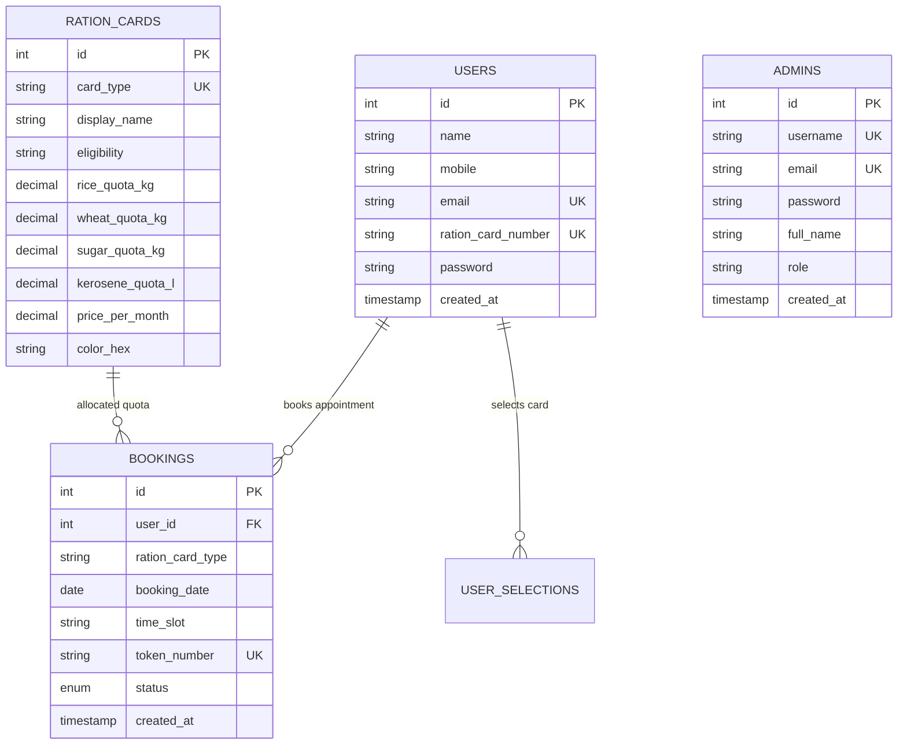

# 🏛️ Online Ration Distribution & Fair Price Shop Slot Booking Portal

A cloud-ready, secure, and modern **Public Distribution System (PDS) Web Portal** built with **PHP 8.2+**, **MySQL**, and **Vanilla CSS**. This system enables citizens to select subsidized grain quota categories (Yellow, Orange, White cards), schedule convenient collection time slots to avoid queues, and generate printable digital e-Passes, alongside an administrative console with analytics, filters, status management, and CSV export.

---

## 🌟 Key Features

### 👤 Citizen Features
- **One-Time Citizen Registration**: Form with 10-digit mobile number, email, and Ration Card validation with `bcrypt` password encryption.
- **Unified Login**: Seamless login using citizen's Name, Email, or Ration Card Number.
- **Interactive Ration Card Selector**:
  - **🟡 Yellow Card (BPL / Antyodaya)**: 20kg Rice, 15kg Wheat, 2kg Sugar, 5L Kerosene.
  - **🟠 Orange Card (APL Subsidized)**: 10kg Rice, 8kg Wheat, 1kg Sugar, 2L Kerosene.
  - **⚪ White Card (Non-Subsidized)**: 5kg Rice, 5kg Wheat, 1kg Sugar, 0L Kerosene.
- **Smart Slot Booking**: Date selection (constrained to next 10 days) + 1-hour distribution windows (10 AM to 5 PM).
- **Printable Digital e-Pass**: Generates a verified appointment pass with unique token number (e.g. `RS-20260818-4A1B2C`), quota breakdown, and `window.print()` / PDF support.

### 🛡️ Administrative Console
- **Secured Department Access**: Password-protected admin interface with session management.
- **Real-Time KPIs**: Track registered citizens, total bookings, today's appointments, and card distribution breakdown.
- **Search & Multi-Filter**: Filter by citizen name, card number, category, date, or appointment status.
- **Live Status Management**: Mark bookings as *Confirmed*, *Completed*, or *Cancelled*.
- **Admin-Only Record Deletion**: Secure deletion of appointment records with an interactive confirmation modal displaying token and citizen details before permanent removal.
- **One-Click CSV Export**: Instant export of all booking records for offline departmental reporting.

---

## 🚀 Instant Cloud Deployment Options

### 1️⃣ Deploy to Render.com (Recommended)
This repository includes a native [`render.yaml`](./render.yaml) blueprint:
1. Fork or push this repository to GitHub/GitLab.
2. Log in to [Render.com](https://render.com) and click **New +** → **Blueprint**.
3. Select your repository.
4. Render will automatically spin up:
   - A **Docker Web Service** running the PHP 8.2 + Apache application.
   - A **Managed MySQL Database** with automated `DATABASE_URL` binding.
5. Once built, the database tables auto-initialize automatically on first request!

---

### 2️⃣ Deploy to Railway.app
This repository includes [`railway.json`](./railway.json) and [`Dockerfile`](./Dockerfile):
1. Go to [Railway.app](https://railway.app) and create a **New Project**.
2. Click **Deploy from GitHub repo** and select this repository.
3. In the Railway project canvas, click **+ New** → **Database** → **Add MySQL**.
4. Railway will automatically inject `MYSQLHOST`, `MYSQLUSER`, `MYSQLPASSWORD`, `MYSQLDATABASE`, and `MYSQLPORT` into the web service.
5. Click the generated URL to access your live portal.

---

### 3️⃣ Deploy with Docker & Docker Compose (Local or Cloud VPS)
To run the complete application and MySQL database in isolated containers with 1 command:

```bash
# 1. Clone or navigate to the project directory
cd ration_shop

# 2. Start the application and database containers
docker-compose up -d --build

# 3. View running containers
docker-compose ps
```

- **Citizen Portal**: [http://localhost:8080](http://localhost:8080)
- **Admin Panel**: [http://localhost:8080/admin_login.php](http://localhost:8080/admin_login.php)
- **MySQL Database**: `localhost:3307` (User: `ration_user`, Password: `ration_pass_secure`, Database: `ration_shop`)

---

### 4️⃣ Deploy to Heroku / Dokku / CapRover
This repository includes a [`Procfile`](./Procfile) and [`app.json`](./app.json):

```bash
# Login to Heroku CLI
heroku login

# Create a new application
heroku create my-ration-shop-portal

# Provision a MySQL database addon (JawsDB or ClearDB)
heroku addons:create jawsdb:kitefin

# Deploy the code
git push heroku main

# Open the application
heroku open
```

---

### 5️⃣ Deploy to Traditional cPanel / Shared Apache / Local XAMPP

1. **Import Database Schema**:
   - Open **phpMyAdmin** (`http://localhost/phpmyadmin`).
   - Create a new database named `ration_shop`.
   - Click **Import** and select the [`schema.sql`](./schema.sql) file.
2. **Configure Files**:
   - Place all project files inside your web root (e.g. `C:\xampp\htdocs\ration_shop` or `public_html`).
   - If using non-default database credentials, adjust environment variables or configure [`db_connection.php`](./db_connection.php).
3. **Access Portal**:
   - Navigate to `http://localhost/ration_shop/index.php`.

---

## 🔑 Default Administrator Credentials

| Role | Username / Email | Password | Access URL |
| :--- | :--- | :--- | :--- |
| **System Administrator** | `admin` / `admin@rationshop.gov` | `admin123` | [`/admin_login.php`](http://localhost:8080/admin_login.php) |

*(Note: Change the default password upon initial production setup in the database or admin settings.)*

---

## 🗄️ Database Architecture



---

## 🔒 Security Best Practices Implemented

- **Password Hashing**: Secure one-way encryption using PHP's native `password_hash($pass, PASSWORD_BCRYPT)`.
- **SQL Injection Prevention**: 100% prepared parameterized statements across both PDO and MySQLi connections.
- **XSS Sanitization**: All dynamic user-facing outputs are wrapped with `htmlspecialchars()`.
- **Session Authentication Guard**: Protected routes (`select_ration_card.php`, `book_slot.php`, `confirmation.php`, `admin.php`) immediately redirect unauthorized guests.
- **Apache Security Directives**: `.htaccess` actively blocks public web access to `.env`, `.sql`, `.git`, `.yaml`, and container configuration files, with clickjacking (`X-Frame-Options`) and MIME-sniffing protections enabled.

---

## 📁 Repository Structure

```
ration_shop/
├── assets/
│   └── css/
│       └── style.css            # Modern design system & print styles
├── db_connection.php            # Cloud-aware database connection & auto-migration
├── schema.sql                   # MySQL database schema & default seed data
├── index.php                    # Public landing page with service overview
├── register.php                 # Citizen registration page & logic
├── login.php                    # Citizen login page & logic
├── logout.php                   # Citizen session logout handler
├── select_ration_card.php       # Card category selection & quota overview
├── process_ration_card_selection.php # Selection POST handler
├── book_slot.php                # Appointment slot scheduling form
├── process_booking.php          # Booking submission & token generator
├── confirmation.php             # Printable digital e-Pass confirmation
├── admin_login.php              # Department admin authentication
├── admin.php                    # Admin dashboard with KPIs, search, CSV export
├── admin_logout.php             # Admin session logout handler
├── Dockerfile                   # Production Docker image (PHP 8.2 + Apache)
├── docker-compose.yml           # Multi-container orchestration (App + MySQL 8)
├── render.yaml                  # 1-Click Render.com blueprint
├── railway.json                 # Railway.app cloud deployment configuration
├── Procfile                     # Heroku / Dokku execution profile
├── app.json                     # Heroku 1-Click App Template
├── fly.toml                     # Fly.io deployment manifest
├── .htaccess                    # Apache security and caching rules
├── .dockerignore                # Clean container build rules
├── .env.example                 # Cloud environment configuration template
└── README.md                    # Deployment manual & documentation
```

---

## 📄 License
This project is open-source and available under the [MIT License](LICENSE).
